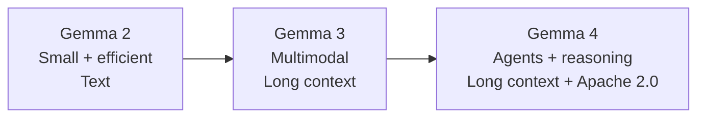
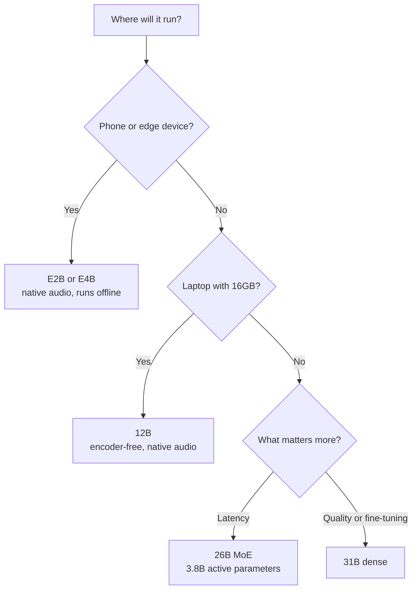
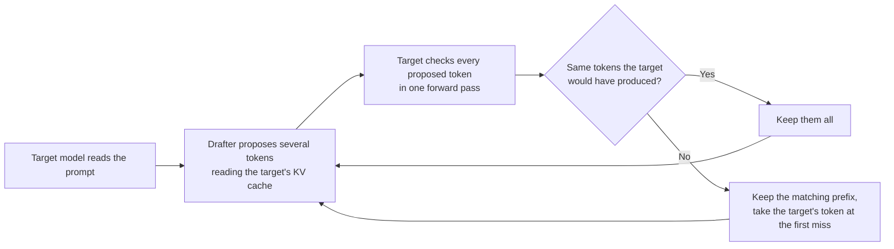
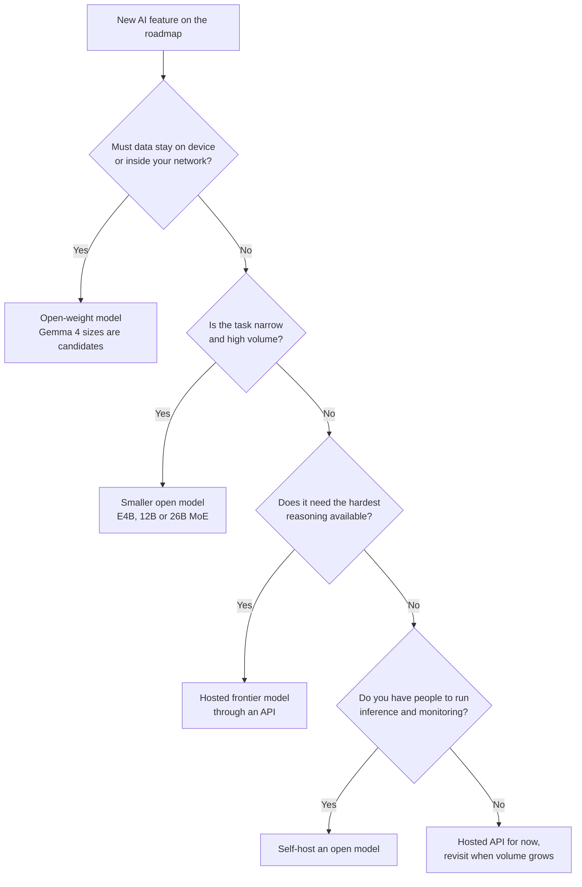
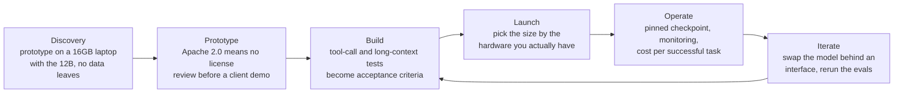

# The Evolution of Gemma: From Gemma 2 to Gemma 4

If you picked Gemma 2 in the summer of 2024, you picked a model with an 8,192 token context window, text in and text out, and a custom license. Check back today and you find a family with up to 256K of context, vision on every size, audio on several, a thinking mode, and plain Apache 2.0. The name stayed the same. The kind of tool did not.

Google says Gemma has been downloaded more than 400 million times, with over 100,000 community variants. That is Google's own count, so treat it as directional. Still, it means a lot of teams built on an older generation and may not have looked back since.

This post walks through what changed from Gemma 2 to 3 to 4, what is genuinely new in Gemma 4, what it means if you own a product roadmap, and what I would test before trusting it with real work. It is written for engineers and for the product managers who sign off on the model choice. One note on method: I haven't run these models for this post. Everything here comes from Google's announcements and technical report, plus a few secondary sources that I label when they matter.

## The short version

If you only remember one thing, make it this: **Gemma 2 made small open models practical. Gemma 3 made them multimodal. Gemma 4 makes them much more useful for local agents and real product workloads.**

The biggest changes are not just bigger benchmark numbers. The interesting changes are the longer context, native multimodal input, tool calling, thinking mode, better inference efficiency, and the move to Apache 2.0.

That last part is easy to overlook, but for teams shipping software to customers, it can matter as much as model quality.

## What actually changed?

There are five changes I think matter most:

1. **The context window got dramatically larger.**
2. **Multimodal input became part of the main Gemma family.**
3. **Gemma 4 added thinking and stronger agent capabilities.**
4. **Inference became more interesting through MoE and speculative decoding.**
5. **The license changed to Apache 2.0.**

The last one might sound like a legal detail. For a product team, it isn't.

## A simple way to think about the three generations



## Three generations at a glance

| | Gemma 2 | Gemma 3 | Gemma 4 |
|---|---|---|---|
| Released | June 27, 2024 | March 12, 2025 | April 2, 2026 |
| Sizes | 2B, 9B, 27B | 1B, 4B, 12B, 27B | E2B, E4B, 12B (added June 3), 26B MoE, 31B |
| Context window | 8,192 tokens | 128K (32K on the 1B) | 128K on E2B and E4B, up to 256K on the larger models |
| Input | Text | Text and image (1B is text only) | Text, image and video on all sizes, plus audio on E2B, E4B and 12B |
| License | Gemma Terms of Use | Gemma Terms of Use | Apache 2.0 |
| Notable additions | Distilled small models, grouped-query attention | 140+ languages, function calling, distillation across the family | Thinking mode, a mixture of experts model, native function calling, encoder-free 12B |

Gemma 2 never had vision of its own. That arrived through a separate line called PaliGemma, built on top of it. Gemma 3 folded images into the main family and stretched the context window by more than 15 times. Gemma 4 is where the agent features and the license finally caught up with how people actually use open models.

## The license change is the real headline

Gemma 3 and everything before it shipped under Google's own Gemma Terms of Use, which is why the family was usually described as source available rather than open source. Gemma 4 ships under Apache 2.0.

Google's own framing is that developers asked for fewer restrictive barriers, and that the new license gives control over data, infrastructure and models, on premises or in the cloud. I read that more plainly. If you deploy into client environments, especially regulated or air-gapped ones, a custom license means a legal review each time. Apache 2.0 is boilerplate that most legal teams already know. For private deployment work, I think this matters more than any benchmark in this post.

Two cautions. I am not a lawyer, so read the license text and the model card for the exact checkpoint you plan to ship. And check the license on Google's official page, not on a re-upload. While researching this I found a community conversion whose metadata said Apache 2.0 while its description said Gemma Terms of Use. Third party packaging can drift.

## What Gemma 4 ships in

Gemma 4 launched with four sizes. A 12B model joined on June 3, so the lineup is now five. The 26B model is a mixture of experts design that activates only 3.8 billion parameters per token, which is why Google positions it for speed. The 31B is a dense model aimed at raw quality and fine-tuning. The small E2B and E4B models use per-layer embeddings, so the report counts them as 2.3B and 4.5B effective parameters out of roughly 5B and 8B in total.

The memory numbers in Google's technical report are the practical ones for planning.

| Model | Size | bf16 weights | Quantized weights | Added KV cache at 32K, int8 | Aimed at |
|---|---|---|---|---|---|
| E2B | 2.3B effective | 4.6 GB | 0.8 GB | +0.05 GB | Phones, edge, IoT |
| E4B | 4.5B effective | 9.0 GB | 2.3 GB | +0.14 GB | Phones, edge |
| 12B | 12B dense | 24.0 GB | 7.65 GB | +0.28 GB | Laptops with 16GB |
| 26B | 26B total, 3.8B active | 52.0 GB | 16.2 GB | +0.28 GB | Low latency on workstation GPUs |
| 31B | 31B dense | 64.0 GB | 19.2 GB | +1.10 GB | Quality and fine-tuning |

Text only figures from the Gemma 4 technical report. The two small models use mobile quantization and the larger ones use Q4_0, so compare along a row, not down a column. Google also says the bf16 weights of the 26B and 31B fit on a single 80GB H100.



The 12B is the most interesting design choice. Most multimodal models bolt a separate vision encoder and audio encoder onto a language model. The 12B drops both. It slices raw audio into 40 millisecond chunks and images into small patches, then projects them straight into the language model's embedding space. In the report, that replaces a 550M parameter vision encoder with a single matrix multiply of about 35M parameters. Fewer moving parts is a real operational win, and Google says it still lands near the 26B model on benchmarks.

## How the long context got cheaper

A long context window is easy to put on a spec sheet. The expensive part is the KV cache, the memory the model keeps for everything it has already read. It grows with every token, and it is usually what stops you from filling the window you paid for.

Gemma 4 attacks that in a few ways. Most layers use local sliding window attention, with one global layer for every five local ones. The global layers use a positional encoding scheme called p-RoPE, share their cache, and reuse keys as values. Google reports that these choices cut the global KV cache by up to 37.5 percent.

The results look good on paper. At 128K tokens on the RULER long-context benchmark, the 31B scores 96.4 against 66.0 for Gemma 3 27B. That is a vendor number on a synthetic benchmark, so my opinion is simple: it tells you the architecture works, not that it will work on your documents. Test with your own.

## Thinking mode and tool calling

Gemma 4 adds something no earlier Gemma had, a thinking mode. The model can write out a reasoning trace before it answers, and you switch it on with a control token in the system turn. Alongside it, Google lists native function calling, structured JSON output, and native system instructions, which are the three things an agent loop leans on.

Google even wired it into Android Studio as a local model for Agent Mode, so the same family that runs on a phone can drive a coding assistant on a developer laptop. Reasoning is not free, though. Expect thinking mode to spend more tokens, and decide per request whether the extra accuracy is worth the latency.

## Speed: the drafter models

On May 5, a month after launch, Google released Multi-Token Prediction drafters for Gemma 4. They use speculative decoding. Normal generation produces one token per pass through the full model, and most of that time goes to moving weights through memory rather than doing math. A small drafter uses that idle capacity to guess several tokens ahead, then the full model checks all the guesses in one pass.



Because the big model verifies everything, Google says the output quality does not change. The drafter itself is small. According to the technical report, it is a four layer transformer that attends to the main model's KV cache, and on the E2B and E4B it uses a trick that shrinks the final projection from the full 262,000 token vocabulary to 4,096 token clusters while keeping a similar acceptance rate.

Google's headline is up to a 3x speedup. The real numbers are lower and depend on hardware. Google's own benchmark has the 26B at roughly 2x on an NVIDIA RTX PRO 6000. On device, the LiteRT-LM documentation puts it at up to 2.2x on mobile GPUs and up to 1.5x on mobile CPUs. One independent write-up measured about 2.2x on Apple Silicon with the MoE models at batch sizes of 4 to 8. Support is broad, including Transformers, vLLM, SGLang, MLX and Ollama.

## The July refresh, and a source disagreement

On July 15, Google updated the Gemma 4 collection on Hugging Face. Secondary write-ups describe four changes: Flash Attention 4 on NVIDIA Hopper GPUs, reportedly 25 to 70 percent faster prefill and up to 31 percent faster time to first token, plus tool-calling reliability fixes, a new default vision configuration for sharper OCR, and chat template corrections.

Here is the catch. Two of those write-ups say the checkpoints themselves were refreshed, so weights pulled earlier are outdated. A third says no new weights or checkpoint were released, only improvements around them. I could not settle that from the sources I have. The safe move is the boring one: pull from the official repository again, check the commit history, and rerun your own tests rather than assuming either account.

## How much better is it, really

Google's technical report compares Gemma 4 against Gemma 3 27B, not Gemma 2, so I do not have a clean Gemma 2 to Gemma 4 benchmark table and I am not going to invent one. Here is the Gemma 3 to Gemma 4 jump, using Google's own numbers.

| Benchmark | Gemma 4 31B | Gemma 3 27B |
|---|---|---|
| MMLU Pro | 85.2 | 67.6 |
| GPQA Diamond | 84.3 | 42.4 |
| LiveCodeBench v6 | 80.0 | 29.1 |
| Terminal Bench Hard | 36.0 | 4.0 |
| Tau2 retail (agent tool use) | 86.4 | 6.6 |
| Tau2 telecom (agent tool use) | 69.3 | 3.1 |
| RULER at 128K tokens | 96.4 | 66.0 |

Two things to keep in mind. These are vendor numbers. And the report runs Gemma 4 in thinking mode, which Gemma 3 does not have, so part of the gap is simply that Gemma 4 gets to reason before it answers. The agent benchmarks are the ones I would look at first, because they track what tool-using systems actually do, and the jump there is the biggest.

Human preference tells a calmer story. At launch, Google said the 31B ranked third among open models on Arena's text leaderboard. In the June 19 snapshot inside the technical report, the 31B sits at an Elo of 1451, 43rd on the full board, behind several much larger open mixture of experts models, and the report calls it the leading dense open model instead. Gemma 3 27B is at 1366 in the same table. Both statements can be true. Leaderboards are snapshots, and this one moves.

## What this means for product teams

The model you pick is a product decision before it is an engineering one. It sets your cost structure, your privacy story, your latency, and how much of your roadmap depends on someone else's release schedule. Gemma 4 changes a few of those trade-offs, so here is how I would frame them. The diagrams below are my own rules of thumb, not a verdict, and your constraints will move the answers.

### A decision flow for the build or buy question



Notice what the flow does not say. It does not say open models are cheaper. Whether self-hosting beats an API depends on your volume and how busy you can keep the hardware, and I have not modeled that here. Run the numbers on your own traffic before you commit.

### Where it fits across the product lifecycle



### What didn't change

It is easy to look at Gemma 4 and assume everything from the previous generations has been replaced. That is not really the story.

Gemma is still built around the same basic idea: capable open-weight models that can run on infrastructure you control.

The difference is how far that idea has been pushed.

Gemma 2 was already useful for teams that wanted a relatively small model they could run themselves. Gemma 3 expanded that into multimodal workloads. Gemma 4 pushes further into agents, long-context tasks, local inference and on-device use.

So this is less of a complete reset and more of a steady shift in what you can realistically build with a small model.

### The product questions Gemma 4 touches

| Product question | What Gemma 4 gives you | What to watch |
|---|---|---|
| Privacy and data residency | Weights you run yourself, under Apache 2.0, in your cloud or on premises | You own the security and guardrails around the model |
| Latency and offline use | E2B and E4B run offline on phones and edge devices, and the drafters add up to 2.2x decoding speed on mobile GPUs | Gains vary a lot by hardware |
| Cost per request | You pay for hardware and operations, not per token, and drafters cut GPU time per response | The break-even point depends on your volume and utilization |
| Vendor and roadmap risk | A checkpoint you hold does not change unless you pull a new one | Google refreshed the collection in July, so pin the revision |
| Pace of change | Three generations in under two years, from June 2024 to April 2026 | Plan for model swaps, keep an eval suite, hide the model behind an interface |

## If I were starting a project today

I would not start with Gemma 2 or Gemma 3 unless there was a specific reason to do so.

For a small local experiment, I'd start with **E4B**.

For a laptop-based application where I need more capability, I'd test **12B**.

If latency is the priority and I have the hardware for it, I'd look at **26B**.

If the goal is maximum quality from the Gemma family and I can afford the infrastructure, I'd test **31B**.

But I would not make the final decision from this table alone. I'd put two or three candidates behind the same interface and run them against the actual tasks my product needs to solve.

That usually tells you more than spending another afternoon reading benchmark tables.

### Acceptance criteria I would put in the spec

Treat the model like any other dependency with a quality bar. For an agent or tool-using feature, I would write these into the spec before building anything.

| Metric | Why it matters |
|---|---|
| Tool-call validity rate | One malformed call can break a whole workflow |
| Task success on a golden set | Your own examples beat any public leaderboard |
| p95 latency | Averages hide the slow requests users remember |
| Cost per successful task | Cost per token ignores retries and failures |
| Human escalation rate | Shows how much work the model really takes off people |

Set the thresholds from your own baseline, not from anyone's benchmark table, including mine.

## What I would test before shipping it

1. Read the license and the model card for the exact checkpoint you will ship, from Google's official page.
2. Pin the checkpoint to a specific commit so a refresh cannot change behavior under you.

```bash
hf download google/gemma-4-31B-it --revision <commit-sha>
```

3. Measure tool-call validity on your own prompts, before and after any checkpoint change. A model that returns well-formed calls 99 times in 100 is a different product from one that does it 90 times in 100. This script assumes you serve the model behind an OpenAI-compatible endpoint, for example with vLLM. Use the tool parser settings from the vLLM documentation for Gemma 4.

```python
import json
from openai import OpenAI

# vllm serve google/gemma-4-31B-it  (plus the tool parser flags from the vLLM docs)
client = OpenAI(base_url="http://localhost:8000/v1", api_key="not-needed")

TOOLS = [{
    "type": "function",
    "function": {
        "name": "create_ticket",
        "description": "Open a support ticket",
        "parameters": {
            "type": "object",
            "properties": {
                "title": {"type": "string"},
                "severity": {"type": "integer", "minimum": 1, "maximum": 5},
            },
            "required": ["title", "severity"],
        },
    },
}]

PROMPTS = [
    "Checkout fails twice a day since the last release, customers are angry.",
    "The settings page logo is slightly blurry on retina screens.",
    # replace with real prompts from your own workload
]

def is_valid_call(message) -> bool:
    if not message.tool_calls:
        return False
    try:
        args = json.loads(message.tool_calls[0].function.arguments)
    except json.JSONDecodeError:
        return False
    return (
        isinstance(args.get("title"), str)
        and isinstance(args.get("severity"), int)
        and 1 <= args["severity"] <= 5
    )

passed = 0
for prompt in PROMPTS:
    resp = client.chat.completions.create(
        model="google/gemma-4-31B-it",
        messages=[{"role": "user", "content": prompt}],
        tools=TOOLS,
    )
    passed += is_valid_call(resp.choices[0].message)

print(f"valid tool calls: {passed}/{len(PROMPTS)}")
```

4. Test long context with your own documents at the lengths you really use. RULER measures something real, but it is not your data.
5. Measure the drafter at your own concurrency. In general, speculative decoding pays off most when decoding is memory bound, which is common at low batch sizes, and the gains shrink as you pack more requests together.
6. Budget tokens for thinking mode, and decide which requests get it.
7. Remember the training cutoff. The report gives January 2025 for the pretraining data, so anything newer has to come from retrieval.
8. Put your guardrails around the model, not inside your hopes for it. Google ran its safety evaluations on the bare model without filters, which is a sensible way to measure the model and a reminder that the layer around it is yours to build. I wrote about that layer in [Prompt vs. Context vs. Harness Engineering](https://kartikbhalerao.in/blog/prompt-context-harness-engineering).

## Where this is still thin

Most of the performance numbers here come from Google. I did not find an independent head to head that I could verify, so treat the benchmark table as the vendor's best case. The details of the July refresh come from secondary write-ups that disagree with each other on one point. The speedup figures depend heavily on hardware and batch size. And I have not run any of this myself, so everything above is research, not experience.

## The takeaway

Before making the final call, I would treat the model as a replaceable component rather than the product itself. The best choice today is the one that meets your quality bar at an acceptable cost and can still be swapped out when your workload or the model landscape changes.

Moving from Gemma 2 to Gemma 4 is not a version bump. It is a different category of tool: from a small research-friendly model with a restrictive license to an open family you can deploy privately, with long context, tool calling, a thinking mode, and a drafter for speed. The question is no longer whether it can do the job on a benchmark. It is whether it holds up on your workload, with your documents, your tools and your latency budget.

So start with the license, pin a checkpoint, and run your own tool-call and long-context tests before anything else. That is a day of work, and it will tell you more than any leaderboard.

## References

1. Google, [Gemma 4: Byte for byte, the most capable open models](https://blog.google/innovation-and-ai/technology/developers-tools/gemma-4/), April 2, 2026.
2. Gemma Team, Google DeepMind, [Gemma 4 Technical Report](https://arxiv.org/pdf/2607.02770), arXiv 2607.02770.
3. Google, [Introducing Gemma 4 12B: a unified, encoder-free multimodal model](https://blog.google/innovation-and-ai/technology/developers-tools/introducing-gemma-4-12b/), June 3, 2026.
4. Google, [Accelerating Gemma 4: faster inference with multi-token prediction drafters](https://blog.google/innovation-and-ai/technology/developers-tools/multi-token-prediction-gemma-4/).
5. Google AI Edge, [Gemma 4 on LiteRT-LM](https://developers.google.com/edge/litert-lm/models/gemma-4), for on-device speedups.
6. Android Developers Blog, [Gemma 4: The new standard for local agentic intelligence on Android](https://android-developers.googleblog.com/2026/04/gemma-4-new-standard-for-local-agentic-intelligence.html).
7. Wikipedia, [Gemma (language model)](https://en.wikipedia.org/wiki/Gemma_(language_model)), for the generation timeline and specs.
8. Decrypt, [Google found a way to make local AI up to 3x faster](https://decrypt.co/367095/google-make-local-ai-3x-faster-no-new-hardware). Secondary source.
9. Sebastien Dubois, [Gemma 4 gets Multi-Token Prediction drafters](https://www.dsebastien.net/gemma-4-gets-multi-token-prediction-drafters-3x-faster-inference-without-quality-loss/). Secondary source, Apple Silicon figure.
10. Aurigait, [Gemma 4 features, benchmarks and guide](https://aurigait.com/blog/gemma-4-features-benchmarks-guide/). Secondary source, July refresh.
11. ExplainX, [Gemma 4 July 2026 update](https://explainx.ai/blog/gemma-4-updates-flash-attention-tool-calling-july-2026). Secondary source, July refresh.
12. Data Science in Your Pocket, [Google updates Gemma 4](https://medium.com/data-science-in-your-pocket/google-updates-gemma-4-the-best-small-llm-is-back-86018f0e2afd). Secondary source, disagrees on whether weights changed.
13. Community GGUF conversion with inconsistent license labels, [AtomicChat on Hugging Face](https://huggingface.co/AtomicChat/gemma-4-31B-it-assistant-GGUF).
14. Kartik Bhalerao, [Prompt vs. Context vs. Harness Engineering](https://kartikbhalerao.in/blog/prompt-context-harness-engineering).
